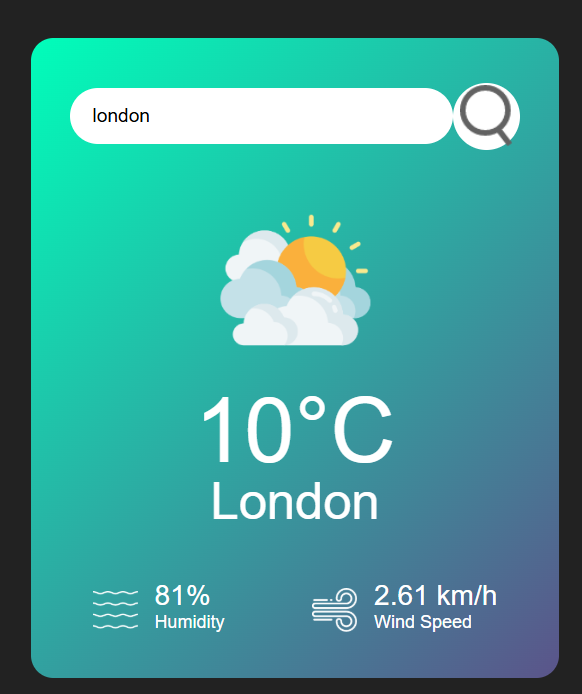

# 🌦️ Weather App

A simple and responsive **Weather Application** built using **HTML, CSS, and JavaScript** that fetches real-time weather data using a Weather API.

This project allows users to search for any city and view the current weather conditions instantly.

---

## 🚀 Features

* 🌍 Search weather by **city name**
* 🌡️ Displays **temperature**
* 💧 Shows **humidity**
* ☁️ Displays **weather conditions**
* ⚡ Fetches **real-time data using API**
* 📱 **Responsive UI** for different screen sizes

---

## 🛠️ Technologies Used

* HTML5
* CSS3
* JavaScript
* Weather API

---

## 📸 Screenshot



---

## 📂 Project Structure

```
weather-app
│
├── index.html
├── style.css
├── script.js
├── weather.png
└── README.md
```

---

## ⚙️ How to Run the Project

1. Clone this repository

```
git clone https://github.com/your-username/weather-app.git
```

2. Open the project folder

3. Run `index.html` in your browser

4. Enter a city name to get weather information

---

## 💡 Future Improvements

* Add **5-day weather forecast**
* Add **location-based weather detection**
* Add **dark mode**
* Improve UI animations

---

## 👩‍💻 Author

**Priya**

---

⭐ If you like this project, feel free to **star the repository**.
